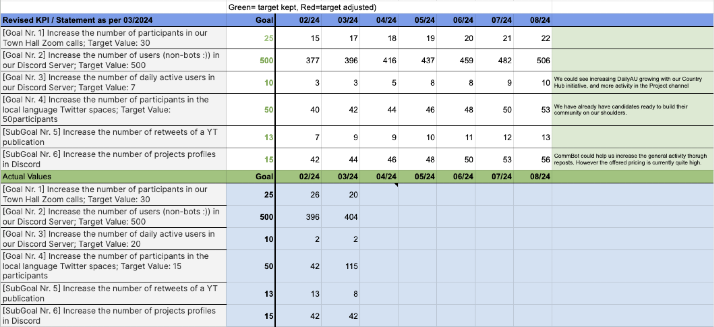

# 🛫 Monthly Report - 03/2024


**Link to Public Report**

[https://github.com/eucardano/operations-framework/blob/main/reports/f11/02-032024.md](../../../reports/f11/02-032024.md)

**Link to March's Timesheet & Payment Receipt**

[https://docs.google.com/spreadsheets/d/1C98gaRhgkghrAsYugu-O7f40Ng1Z1TerIC8ycBGE\_wo/edit#gid=1916200438](https://docs.google.com/spreadsheets/d/1C98gaRhgkghrAsYugu-O7f40Ng1Z1TerIC8ycBGE\_wo/edit#gid=1916200438)

**Link to Statistics**&#x20;

[https://docs.google.com/spreadsheets/d/1C98gaRhgkghrAsYugu-O7f40Ng1Z1TerIC8ycBGE\_wo/edit#gid=689961644](https://docs.google.com/spreadsheets/d/1C98gaRhgkghrAsYugu-O7f40Ng1Z1TerIC8ycBGE\_wo/edit#gid=689961644)


<table><thead><tr><th width="308">Position</th><th width="135" align="right">Amount in ADA</th><th width="204">Comment</th><th width="163" data-type="content-ref">Tx</th></tr></thead><tbody><tr><td>ECC Core Team operations</td><td align="right">3.465,20</td><td></td><td><a href="https://cardanoscan.io/transaction/56985e3a1f1286a981ac0d0fb050930e5c265ec1013e67a3a70a2757513a3189">https://cardanoscan.io/transaction/56985e3a1f1286a981ac0d0fb050930e5c265ec1013e67a3a70a2757513a3189</a></td></tr><tr><td>ECC Core Team support member</td><td align="right">24,93</td><td>Calculation shows a different amount of 63 ADA as we haven't built for this edge case yet.</td><td><a href="https://cardanoscan.io/transaction/4cf0d6289e40acca8f0c5231601bf8af1900738319acb0965164d746fb4a522b">https://cardanoscan.io/transaction/4cf0d6289e40acca8f0c5231601bf8af1900738319acb0965164d746fb4a522b</a></td></tr><tr><td>X-Space: Italian (2hosts)</td><td align="right">170</td><td></td><td><a href="https://cardanoscan.io/transaction/a1640ad254b1c32efd7475a08f846f2fe6b5f0175f115b196ce3d5a8a4285f46">https://cardanoscan.io/transaction/a1640ad254b1c32efd7475a08f846f2fe6b5f0175f115b196ce3d5a8a4285f46</a></td></tr><tr><td>X-Space: Italian (2hosts)</td><td align="right">170</td><td>Wrong Descriptor as Greek</td><td><a href="https://cardanoscan.io/transaction/cfc66d544f746d5cd307fbcdeffc83337b23a9295b5bd83e0bf2ba1805879f03">https://cardanoscan.io/transaction/cfc66d544f746d5cd307fbcdeffc83337b23a9295b5bd83e0bf2ba1805879f03</a></td></tr><tr><td>X-Space: Greek (2hosts)</td><td align="right">170</td><td>DAOWallet</td><td><a href="https://cardanoscan.io/transaction/ea7be99323a31767976c33357256c82d2241cb7b2f9b43b57807c7fc62e76959">https://cardanoscan.io/transaction/ea7be99323a31767976c33357256c82d2241cb7b2f9b43b57807c7fc62e76959</a></td></tr><tr><td>Merch compensation for TECH pool</td><td align="right">185</td><td>Ledger Backup (arrived in March) </td><td><a href="https://cardanoscan.io/transaction/f210fa6bbce93d5f2b2b716634c75e198363bf6982bfe1cdb34c1c8cfa7a2bec">https://cardanoscan.io/transaction/f210fa6bbce93d5f2b2b716634c75e198363bf6982bfe1cdb34c1c8cfa7a2bec</a></td></tr><tr><td></td><td align="right"></td><td></td><td></td></tr></tbody></table>

### YouTube Video References:













[https://github.com/orgs/eucardano/projects/4/views/2?pane=issue\&itemId=54470033](https://github.com/orgs/eucardano/projects/4/views/2?pane=issue\&itemId=54470033)

## KPI Updates

<figure><figcaption></figcaption></figure>

\
X-Spaces
--------

#### Italy #1

March 7th, 41 tuned in, 1:01:52\
[https://twitter.com/i/spaces/1ZkKzjWLjpWKv?s=20](https://twitter.com/i/spaces/1ZkKzjWLjpWKv?s=20)

#### Italy #2

March 22nd, 70 tuned in, 1:32:46\
[https://twitter.com/i/spaces/1RDGllYlnRjGL?s=20](https://twitter.com/i/spaces/1RDGllYlnRjGL?s=20)

####
