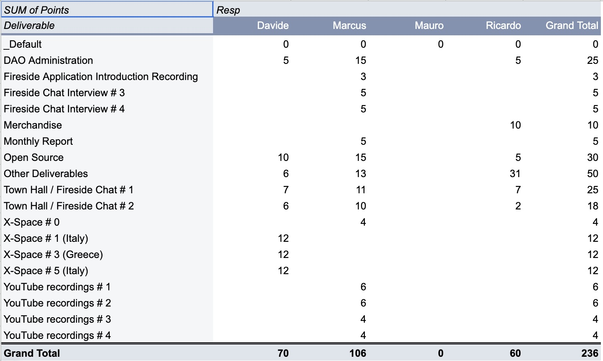
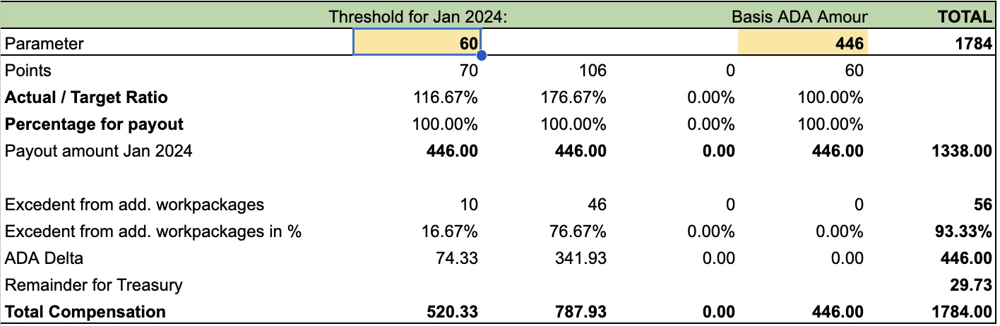

# 🦄 Team Compensation 01/2024

<figure><figcaption>
Overview: Points
</figcaption></figure>

<figure><figcaption>
Overview: Payout
</figcaption></figure>

| Member          | Address                                                                                                 | Amount in ADA |
| --------------- | ------------------------------------------------------------------------------------------------------- | :-----------: |
| Ricardo Burgos  | addr1qxy5lvqzngl8n5le9flckyfx4uwrhycam2n4xj2ecs298vaqfa3ryeggjyxsr3afdevzcx7gt7yvhde69xlr498rfwtqv0xaqu |     446.00    |
| Marcus Ubani    | addr1qyflj2tms4c87k066mt8j6pmaqarh3uqe59nq0hly0rhdpa72nppkzyc0zdth2cm6q8a2v6jd9y8qqdnd05w2cgkxm5stqsgkk |     787.93    |
| Davide Lucchesi | addr1qxruauuk7zdalgpmcd2czxj4a78ljlcxf2etdu47wjytmaf7qe8q04zrre08yqzzqxk3n329hrnd8hpg8pxffupg97wqrh5fly |     520.33    |
| Mauro Andreoli  | addr1qx2rhevr07na8v2ejq0xjaxs2m8nnw5ddv9kz3yrwr650fmy3377y7pmdf7sf2d3ral3ke54uwk6lz49dker65s009tqul20uj |      0.00     |

An email with the underlying data was sent to all team members for reference on Aug 7th 2024

Link to the transaction: \
[https://adastat.net/transactions/8188ab349c7219e302865c17df7801bf84f4eb82990d657f7bd09cf2c078ab86](https://adastat.net/transactions/8188ab349c7219e302865c17df7801bf84f4eb82990d657f7bd09cf2c078ab86)
