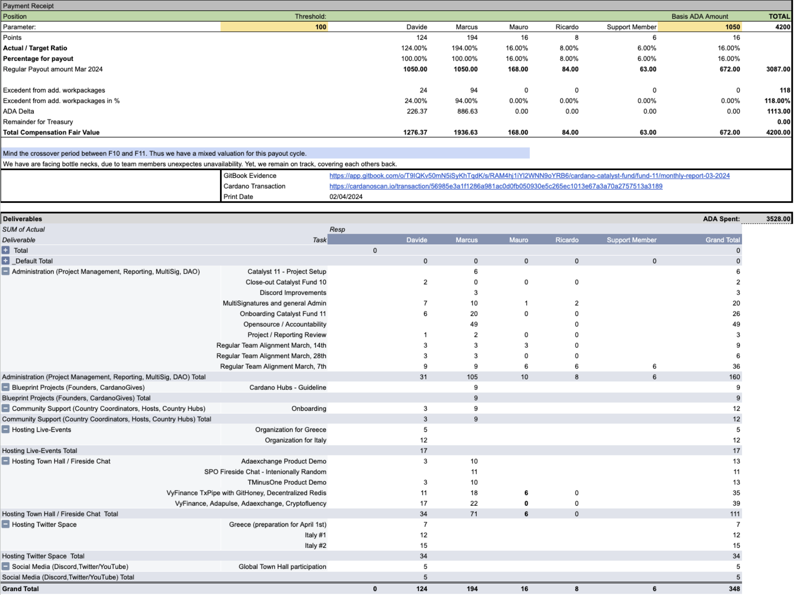

# 🦄 Team Compensation 05/24

<figure><figcaption>
Payouts and Deliverables
</figcaption></figure>

The Statement shows a higher value than the actual payout. This comes from a reimbursement calculation prior to the changes in our parameters increasing the threshold to reach rewards.&#x20;

Thus the delta 38.07ADA stems from the rewards calculated for the support member, here given at 63.00ADA but in reality paid as 24.93ADA, matching the former calculation.

| Member          | Address                                                                                                 |   Amount in ADA   |
| --------------- | ------------------------------------------------------------------------------------------------------- | :---------------: |
| Ricardo Burgos  | addr1qxy5lvqzngl8n5le9flckyfx4uwrhycam2n4xj2ecs298vaqfa3ryeggjyxsr3afdevzcx7gt7yvhde69xlr498rfwtqv0xaqu |       84.00       |
| Marcus Ubani    | addr1qyflj2tms4c87k066mt8j6pmaqarh3uqe59nq0hly0rhdpa72nppkzyc0zdth2cm6q8a2v6jd9y8qqdnd05w2cgkxm5stqsgkk |      1936.63      |
| Davide Lucchesi | addr1qxruauuk7zdalgpmcd2czxj4a78ljlcxf2etdu47wjytmaf7qe8q04zrre08yqzzqxk3n329hrnd8hpg8pxffupg97wqrh5fly |      1276.37      |
| Mauro Andreoli  | addr1qx2rhevr07na8v2ejq0xjaxs2m8nnw5ddv9kz3yrwr650fmy3377y7pmdf7sf2d3ral3ke54uwk6lz49dker65s009tqul20uj | 
 168.00
 |

An email with the underlying data was sent to all team members for reference on April 1st 2024

Link to the transaction: \
[https://cardanoscan.io/transaction/56985e3a1f1286a981ac0d0fb050930e5c265ec1013e67a3a70a2757513a3189](https://cardanoscan.io/transaction/56985e3a1f1286a981ac0d0fb050930e5c265ec1013e67a3a70a2757513a3189)
