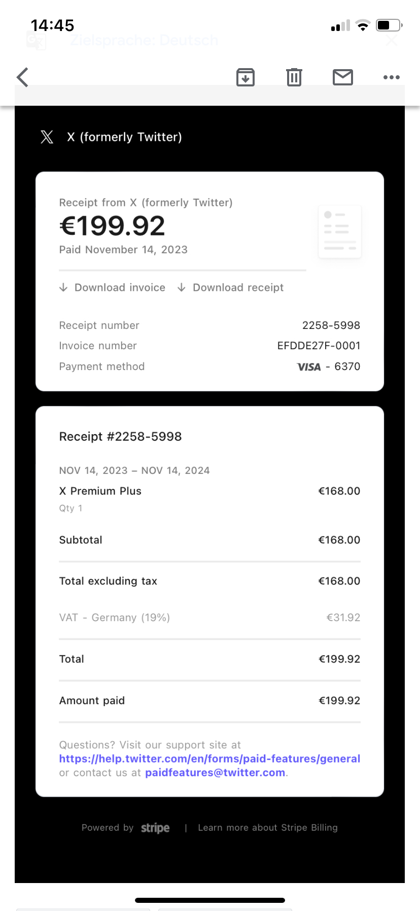

# X and Zoom Accounts

## Overview of Payments

| Tool / Date                          | EUR Amount | Exchange rate  | Value in ADA |
| ------------------------------------ | ---------- | -------------- | ------------ |
| 
X Account -  Nov 14th 2023
 | 199.92     | 0,335508       | 595.87       |
| 
Zoom -  Nov 8th 2023
       | 17.84      | 0,358486       | 49.76        |
| 
Zoom -  Oct 8th 2023
       | 17,84      | 0,256503       | 69.55        |
|                                      |            | Sum in ADA     | 715.18       |
| + Fee                                |            |                | 0.187809     |
|                                      |            | Total TX       | 715.37       |

## X-Account (Pro for one year)

Invoice and payment receipt:

<figure><figcaption></figcaption></figure>

<figure><figcaption>
X-Pro account
</figcaption></figure>

##

## Zoom Oct and Nov

<figure><figcaption></figcaption></figure>

 

<figure><figcaption></figcaption></figure>

Exchange Rates via CoinGecko:

<figure><figcaption></figcaption></figure>

 

<figure><figcaption></figcaption></figure>

