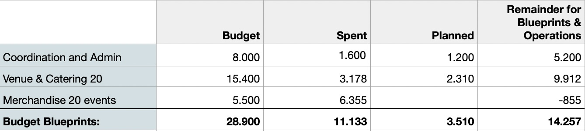

### Change Request 

ref. docs: https://docs.projectcatalyst.io/current-fund/general-information/requesting-a-change-to-funded-project-from-f10-onwards

sent to: catalyst@iohk.io 

Title: European Cardano Community Town Hall - Operation and Country Hubs

Project F11-ID: 1100129

Link: https://cardano.ideascale.com/c/cardano/idea/112747

#### Pivot-Request: 

Dear Catalyst Team, we are requesting a change of timeline and funding allocation.

We waited with this request to gain a better understanding of the current numbers and upcoming developments.

Our Country Hub workshops intended to gather experts and founders to collect knowledge and information about trending questions that need to be answered - either in the current or future blueprints. 

We did enable a total of 4 out of planned 20 workshops and have another 3 scheduled by community members from Nov 24 to Jan 25. Given that these workshops will be held, the success rate for conducted Country Hub workshops is at 35%.We see our proposition as unique in the European ecosystem. But we also underestimated the motivational competition with workshops/events funded by intersectMBO and Cardano Foundation. 

In comparison the benefits for hosting intersectMBO's (iM) or Cardano Foundation's (CF) events are better. 

While we also provide funds to the hosts, their rewards are considerably lower and seemingly align with the perceived opportunity of the hosts to grow in the ecosystem. We acknowledge this, especially as it wasn't our intention in the first place to compete against iM or CF around the hosting of events. Our core value proposition is being a hub for founders.

When an ECC workshop was discussed with hosts and the opportunity was given to prepare a workshop for the other entities, then hosts preferred to conduct the latter. This principle applied also for already scheduled workshops and clearly outlines the preferences of community members. However, we strongly believe and see, that planned blueprints are still a dire need to support founders. As the information collection points for the blueprints couldn't be utilized as much as we wanted, we would need to reallocate those funds towards research and writing the blueprints directly by the ECC core team. 

Remainders will be used to keep operations (i.e. merch Shipping, Fireside Chats, PitchFests, Xspaces, NFTweekends) alive.

#### Financial Statement

To be prepared for spontaneous workshop requests and to increase effiency in regards to shipping merchandise articles, we have pre-ordered all possible items for 20 events. The initial Budget was at 5.500, however, due to a price drop of ADA and the needed investment amount execeded this budget. The merchandise articles will be distributed at different occasions.

14.257 ADA will be reallocated to research and creation of the blueprints.

Our suggestion would be a distribution of  4.989,95 (35%), 4.989,95 (35%), and 4.277,1(30%) which would alter the total budget distribution 

*from* M1: 19.325 (25%), M2: 19.325 (25%), M3: 27.055 (35%), MF: 11.595 (15%) 

*to* M1: 19.325 (27,65%), M2: 17.090 (24,46%), M3: 21.930 (31,38%), MF: 11,537 (16,51%);

*if* this suggestion contradicts the distribution regulations of Project Catalyst, then we'd adapt the workload to .

The timeline would be needed to extended for 

- Milestone 2 until 10/2024. 
- Milestone 3 until 01/2025.
- Final Milestone until 02/2025

